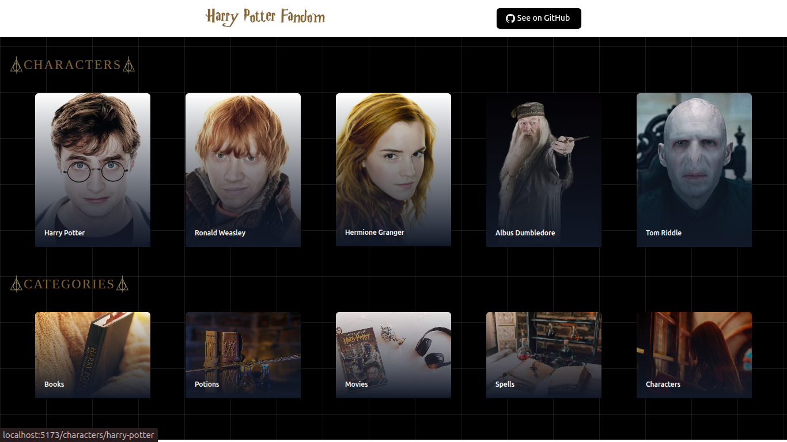

# 🧙‍♂️ Harry Potter Fandom

Explore the magic of the Harry Potter universe through a modern, fast, and interactive web app. This application showcases characters, spells, potions, houses, books, and movies using data from the [Potter DB API](https://potterdb.com/).

🔗 **Live Demo:** [https://harry-potter-db-dusky.vercel.app/](https://harry-potter-db-dusky.vercel.app/)

---

## 📸 Screenshots

### Home Page

---

## 📖 Project Overview

This app is a React + TailwindCSS - based frontend that fetches magical data from the Potter DB API. The interface is styled with Tailwind CSS, offering a modern user experience for Harry Potter fans and developers alike.

---

## ⚙️ Technologies Used

### 🔧 Frontend

- [React](https://reactjs.org/)
- [Tailwind CSS](https://tailwindcss.com/)

### 🌐 API

- [Potter DB API](https://potterdb.com/) – Provides access to characters, spells, potions, books, and more

---

## 🛠️ Features

- ✅ View a full list of characters, spells, potions, and books
- 🔍 Search through all categories
- 📱 Mobile-responsive design

---

<!-- ## 📁 Folder Structure -->
